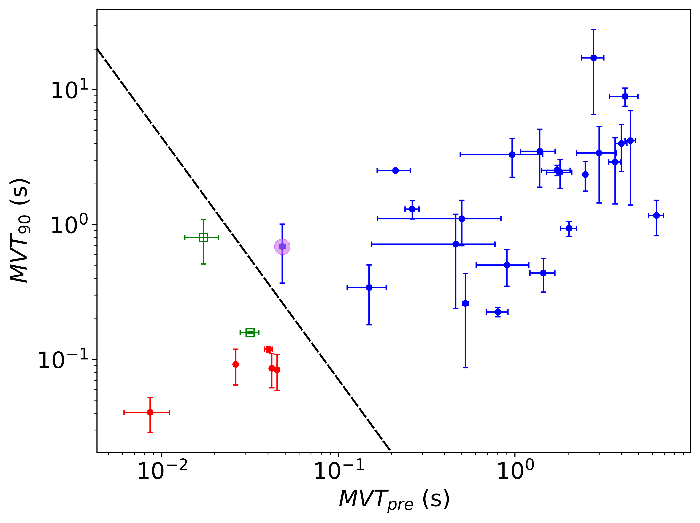
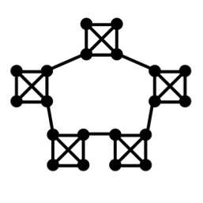
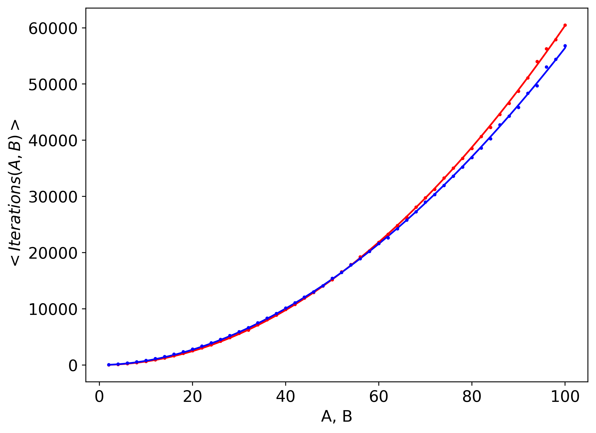
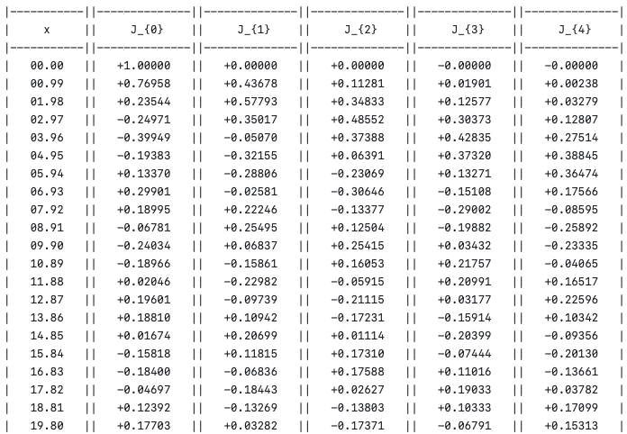

## Programming Experience

**Python: Intermediate**
- Proficient in writing and optimizing functions, handling errors, and managing file I/O operations.
- Solid understanding and use of object-oriented programming (OOP) principles, including classes and inheritance.
- Experienced with popular libraries and frameworks such as `pandas`, `Numoy`, `Matplotlib` for data manipulation and `requests` for API calls.

**C: Beginner-Intermediate**
- Familiar with multi-level pointers and dynamic memory allocation.
- Capable of implementing and managing matrices and using structures.
- Competent in file handling and utilising standard C libraries for various tasks.

**Swift: Basic Experience**
- Developed simple IOS applications including a BMI calculator, a dice roller, and a Magic 8-Ball app.

The projects listed below are ordered by the time taken to complete, which generally reflects their complexity and difficulty.

---

## Final project at university: Discriminating the light-curves of long and short gamma ray bursts - <small>Python</small>

# Overview

The aim of my final year university project was to computationally classify the progenitor population of long and short gamma-ray bursts (GRBs) using their lightcurve (LC) alone. This involved developing a pipeline that leverages data analysis libraries in Python to process and analyse GRB data.

I used `pandas` dataframes to store the LC flux data in order to compute a mathmatical function termed a Haar scalorgarm,

$$
\sigma_{\Delta t}^{2} = \frac{\Delta t}{t}\sum\limits_{i=0}^{t/2\Delta t -1}h^{2}_{i, \Delta t},
$$

given,

$$
h_{i, \Delta t} = \overline{X}_{2i+1, \Delta t} - \overline{X} _{2i, \Delta t},
$$

and where $\overline{X}$ is the average natural logarithm of the flux over ∆t consecutive bins, $X$. From this I used `numpy` to fit an $n^{th}$ order polynomial to the data, which typically follows a sigmoidal function, and determined its first derivative maximum between the local minima and maxima to define the minimum variable timescale (MVT) of interest. Short of identifying the best fit polynomial visually, I set up a fully automatic pipeline to compute the MVT of around 100 GRBs.  

The early work analysing the MVT presented in this project provides a promising avenue for discriminating the progenitor source of GRBs, and is currently undergoing further validation for potential publication. This project also received a mark of 80% and you may read the full report titled `Report.pdf`. 

## Key Concepts Demonstrated

- **Data Manipulation with Pandas:** Utilises pandas for efficient handling, filtering, and transformation of large datasets (up to 1 million rows).
- **UNIX Command-Line Tools:** Frequent use of UNIX commands to download GRBs and implemented a Bash script to automate the process for a array of GRB names. 
- **Scientific Computing with NumPy:** Employs NumPy for numerical calculations, array operations, and fitting of polynomials.
- **Matplotlib for Data Visualization:**  Uses Matplotlib extensively for plotting data.
- **Parallel Processing:** Implements joblib's Parallel library for parallel computations, significantly reducing processing time.
- **File Handling and OS Operations:** Deploys the `os` module for handling file operations and navigating the file system.
- **Web Scraping with BeautifulSoup:** Uses requests and BeautifulSoup for extracting data from the *Swift* database to automatuically extract the duration of a given GRB 
- **Polynomial Fitting and Derivatives:** Fits polynomial models to data and analyzes their derivatives to find critical points.
- **Error Propagation:** Calculates and includes error propagation in Haar Scalogram calculations.
- **Data Export:** Manages data export to csv, txt, and xlsx files for later use or analysis.
- **Statistical Analysis:** Conducts statistical analysis of findings using the spearmanr class from `SciPy`
- **Astropy:** Uses Astropy for handling FITS files and performing specific astronomical calculations.

  
## Results

I found that short-duration bursts have a much smaller precursor (gamma burst preceding the main emmsion) MVT on average than their long-duration counterparts, and importantly, find a strong coupling of the anomalous GRBs (green) with the former. Therefore providing a way to potentially differentiate the two progenitor sources where precursors are available. The plot below shows how one may seperate potential merger orginating bursts (blue) from collapsar dependent ones (red). 

View [Discriminating Progenitor Population](https://github.com/ryancoulman/Discriminating-Progenitor-Population-GRBs) for more details or read the [full report](https://github.com/ryancoulman/Discriminating-Progenitor-Population-GRBs/blob/main/Report.pdf).

---

## Modelling a d-dimensional random walk on a infinite cartesian grid - <small>C</small>

**Overview**

This project implements a random walk simulation in multiple cartesian dimensions using C. The code demonstrates proficiency in several fundamental programming concepts, including dynamic memory allocation, use of structs, file I/O, and modular code organization.
This project was part of my final year module 'Programming' and received a mark of 88%. Please see `code_report.pdf` to see extensive testing of the programs capabilities and an explanation of the approach involved.   

**Features**

- **Multi-Dimensional Random Walk:** Simulates random walks in configurable dimensions and grid sizes.
- **High-Performance Computation:** Efficiently handles large-scale simulations using dynamically allocated memory.
- **Data Output:** Outputs the results of simulations to CSV files for further analysis.

**Key Concepts Demonstrated**

- **Dynamic Memory Allocation:** Utilises `malloc`, `realloc` and `free` to manage memory for simulation structures.
- **Pointers:** Accesses and amends main() defined variables within functions using pointers.
- **Structs:** Defines and manipulates complex data structures to represent the state of the random walk.
- **File I/O:** Writes simulation results to CSV files for visualization and analysis.
- **Random Number Generation:** Uses random functions to simulate the movement of particles in the grid.

*Decreased scaling of I ̄ with N in 1D (red), 2D (blue), 3D (green), 4D (yellow).*

View [Rand Walk Grid](https://github.com/ryancoulman/d-Dimensional-Random-Walk-Grid) for more details.

---

## Modelling a multi-particle 2-dimsional random walk on a finite hetrogenous network - <small>C</small>

**Overview**

This project builds upon the foundation of the random walk project above. It demonstrates proficiency in several key programming concepts including dynamic memory allocation, use of structs, file I/O, and modular code organization. The random walk is simualted upon the network below with a dynamic number of components and nodes within each. 

This project was part of my final year module 'Programming' and received a mark of 88%. Please see `code_report.pdf` to see extensive testing of the programme's capabilities and an explanation of the approach involved.  
 
**Features**

- **Multi-Particle Random Walk:** Simulates a multi-particle random walk using an array of 'particle' structs. 
- **High-Performance Computation:** Efficiently handles large-scale simulations using dynamically allocated memory.
- **Data Output:** Outputs the results of simulations to CSV files for further analysis.

**Key Concepts Demonstrated**

- **Dynamic Memory Allocation:** Utilizes `malloc` and `free` to manage memory for simulation structures.
- **multi-level pointers:** Accesses and amends main() defined variables within functions using pointers, as well as defining pointers to pointers to dynamically allocate memory for matricies.
- **Structs:** Defines and manipulates complex data structures to represent the state of the random walk and the numerous particles.
- **File I/O:** Writes simulation results to CSV files for visualization and analysis.
- **Random Number Generation:** Uses random functions to simulate the movement of particles in the network.

View [Rand Walk Network](https://github.com/ryancoulman/2D-Random-Walk-Network) for more details.

---

## Classic Snake Game - <small>Python</small>

**Overview**

Experience the classic Snake arcade game using Python's `turtle` module. This game allows you to relive the nostalgia of the arcade with a simple yet engaging implementation. The game records and stores your high score in a text file, updating it whenever you achieve a new high score. Control the snake using the keyboard arrows and try to beat your own high score!

**Features**

- *Classic Gameplay:* Navigate the snake to eat the food, which makes it grow longer.
- *High Score Tracking:* The game records your high score in a `highscore.txt` file and updates it if you achieve a new high score.
- *Keyboard Controls:* Use the arrow keys to change the snake's direction.
- *Continuous Movement:* The snake moves continuously, adding to the challenge.

View [Snake_game](https://github.com/ryancoulman/Snake-Game) for more details.

---

## Approximating bessel function solutions using the composite trapezium rule - <small>C</small>

**Overview**

This project aims to implicitly solve a simplified form of the Bessel function, 

$$
J_{m}(x) = \frac{1}{\pi}\int_{0}^{\pi} \text{cos}(m \theta - x \text{sin} \theta) \ d \theta,
$$

in C, using the composite trapezium rule (CTR) to approximate the integral. This demonstrates proficiency in mathematical computations, numerical methods, and efficient data handling. The calculator computes Bessel functions of the first kind for various orders and outputs the results in a neatly formated text file.

**Features**

- **Bessel Function Computation:** Calculates Bessel functions of the first kind $J_{m}(x)$ for orders $m = 0$ to $m = 9$.
- **High-Precision Output:** Generates high-precision values suitable for scientific and engineering applications.
- **Tabular Data Output:** Outputs results in a tabular format for easy analysis and interpretation.

**Key Concepts Demonstrated**

- **C Programming:** Utilises functional C programming for mathematical calculations.
- **Numerical Methods:** Implements the CTR to approximate the integral to a high degree of accuracy using $N = 10,000$ sub-intervals.
- **File Handling:** Efficiently manages output large dataset operations to a .txt file.
- **Algorithm Implementation:** Develops efficient algorithms to perform complex mathematical computations.
- **Efficiency Optimization:** Once calcuated, samples the Bessel function at varied m and x values using a smaller N to verify the precision to the number of decimal places rquested by the user, improving computational efficiency by reducing N when possible if the output is unchanged.

View [Bessel Function Calculator](https://github.com/ryancoulman/CTR-Bessel-Function-Calculator) for more details.

---

## Pong - <small>Python</small>
