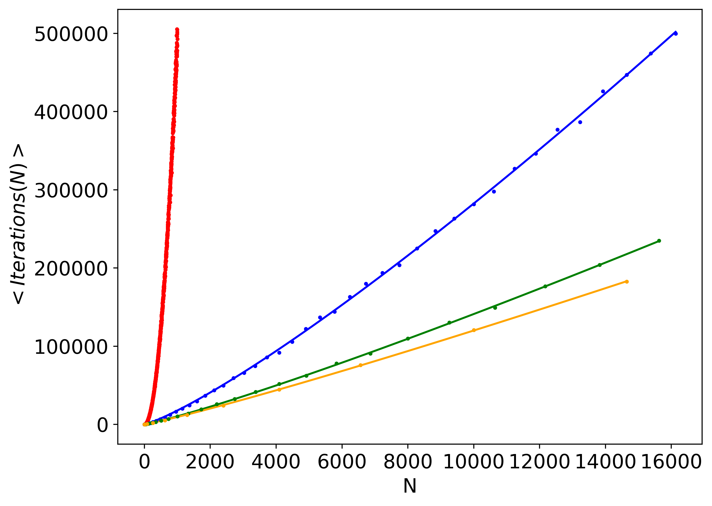
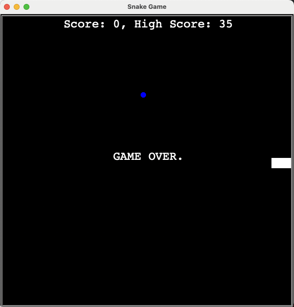

### Programming Experience

**Python: Intermediate**
- Proficient in writing and optimizing functions, handling errors, and managing file I/O operations.
- Solid understanding and use of object-oriented programming (OOP) principles, including classes and inheritance.
- Experienced with popular libraries and frameworks such as `pandas`, `Numoy`, `Matplotlib` for data manipulation and `requests` for API calls.

**C: Beginner-Intermediate**
- Familiar with multi-level pointers and dynamic memory allocation.
- Capable of implementing and managing matrices and using structures.
- Competent in file handling and utilising standard C libraries for various tasks.

**Swift: Basic Experience**
- Developed simple applications including a BMI calculator, a dice roller, and a Magic 8-Ball app.

The projects listed below are ordered by the time taken to complete, which generally reflects their complexity and difficulty.

---

### Final project at university: Discriminating the light-curves of long and short gamma ray bursts - <small>Python</small>
explain (indepndent code worked in partner) 
link to code
used unix 
linkt to FYP report 
Potential to be publsihed 

View [Discriminating Progenitor Population](https://github.com/ryancoulman/Discriminating-Progenitor-Population-GRBs) for more details.

---

### Modelling a d-dimensional random walk on a infinite cartesian grid - <small>C</small>

**Random Walk Simulation**

This project implements a random walk simulation in multiple cartesian dimensions using C. The code demonstrates proficiency in several fundamental programming concepts, including dynamic memory allocation, use of structs, file I/O, and modular code organization.
This project was part of my final year module 'Programming' and received a mark of 88%. Please see `code_report.pdf` to see extensive testing of the programs capabilities and an explanation of the approach involved.   

**Features**

- **Multi-Dimensional Random Walk:** Simulates random walks in configurable dimensions and grid sizes.
- **High-Performance Computation:** Efficiently handles large-scale simulations using dynamically allocated memory.
- **Data Output:** Outputs the results of simulations to CSV files for further analysis.

**Key Concepts Demonstrated**

- **Dynamic Memory Allocation:** Utilises `malloc`, `realloc` and `free` to manage memory for simulation structures.
- **Pointers:** Accesses and amends main() defined variables within functions using pointers.
- **Structs:** Defines and manipulates complex data structures to represent the state of the random walk.
- **File I/O:** Writes simulation results to CSV files for visualization and analysis.
- **Random Number Generation:** Uses random functions to simulate the movement of particles in the grid.

caption
View [Rand Walk Grid](https://github.com/ryancoulman/d-Dimensional-Random-Walk-Grid) for more details.

---

### Modelling a multi-particle 2-dimsional random walk on a finite hetrogenous network - <small>C</small>

View [Rand Walk Network](https://github.com/ryancoulman/2D-Random-Walk-Network) for more details.

---

### Classic Snake Game - <small>Python</small>

**Overview**

Experience the classic Snake arcade game using Python's `turtle` module. This game allows you to relive the nostalgia of the arcade with a simple yet engaging implementation. The game records and stores your high score in a text file, updating it whenever you achieve a new high score. Control the snake using the keyboard arrows and try to beat your own high score!

**Features**

- *Classic Gameplay:* Navigate the snake to eat the food, which makes it grow longer.
- *High Score Tracking:* The game records your high score in a `highscore.txt` file and updates it if you achieve a new high score.
- *Keyboard Controls:* Use the arrow keys to change the snake's direction.
- *Continuous Movement:* The snake moves continuously, adding to the challenge.

View [Snake_game](https://github.com/ryancoulman/Snake-Game) for more details.

### Approximating bessel function solutions using the composite trapezium rule - <small>C</small>

View [Bessel Function Calculator](https://github.com/ryancoulman/CTR-Bessel-Function-Calculator) for more details.

---

### Pong - <small>Python</small>
